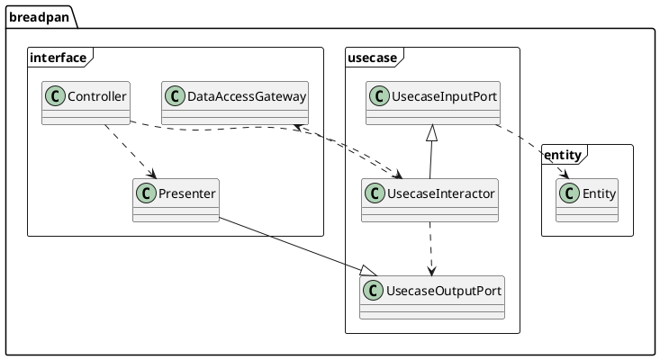

Breadpan
========

- [Breadpan](#breadpan)
  - [Basic architecture](#basic-architecture)
  - [Getting started by example, `to-do management`](#getting-started-by-example-to-do-management)
    - [1. Installation](#1-installation)
    - [2. Define the entities](#2-define-the-entities)
    - [3. Implement the usecase layer](#3-implement-the-usecase-layer)
    - [4. Implement the the interface layer - Controller and Presenter](#4-implement-the-the-interface-layer---controller-and-presenter)
    - [5. Implement the the interface layer - DataAccessGateway](#5-implement-the-the-interface-layer---dataaccessgateway)
    - [7. Implement the the interface layer - View](#7-implement-the-the-interface-layer---view)
  - [Demo project](#demo-project)
  - [More reference to read](#more-reference-to-read)

 The framework implemented the architecture by following 'Clean architecture' in python.


>This implementation includes:
>
>- The basic application structure to apply 'clean architecture' concepts including presenter, controller, interactor, and data gateway
>- The example of RESTful API server
>
>And it didn't include:
>
>- No real implementation of data gateway for RDBMS or NoSQL DB


<hr/>

Basic architecture
------



BreadPan has three layers.

- `entity` : The layer that has the entities to represent the information structure
- `usecase` : The layer that embraces the business logic
- `interface` : The layer that handles the out side resources including external APIs, database, and peripherals.

You can design the system architecture by following these layering rules. I understand the key ideas of clean architectures are

1. Define the information clearly.
2. Separate the internal and external modules to test internal module without any dependency of external modules.
3. (This is my idea from the experience) You can make redundency interface and modules for easy maintanance but don't allow the reduendency of functions and constant by copy and paste.  

<br/>
<hr/>

Getting started by example, `to-do management`
-----

### 1. Installation

You can install the breadpan package like the following.

``` bash
pip install breadpan
```

<br>

### 2. Define the entities

 If you design the software architecture, you'll begin from the 'defining of information structure'. The information is composed from the data. The `entity`is the single unique object in the real world that is being mastered. (From [this](https://www.ibm.com/docs/en/imdm/12.0?topic=concepts-key-entity-attribute-entity-type) document)

 With breadpan, you can define the entity by inherited from the `breadpan.entity` like the following.

```python
from breadpan.entity import Entity

class ToDoEntity(Entity):
    """Example of data entity class for ToDo
    """
    def __init__(self, todo_id:str, task:dict):
        """Contructor

        Arguments:
            Entity {Entity} -- Base entity class
            todo_id {str} -- ID of todo item. Linked to entity_key.
            task {dict} -- Contents of todo task.
        """
        self.entity_key = todo_id
        self.task = task
```

<br>

### 3. Implement the usecase layer

As a `to-do management`, we need five operations at least.

- Create a new `to-do` item
- Read `to-do` user made
- List up `to-do` items  
- Update `to-do` item
- Delete `to-do` item

These operations are very independent from any views or external database or APIs. So we can make abstract interface and we call it `DataAccessGateway`. Then we can separate real operation and external interface with `breadpan.UsecaseInteractor` like the following.  

```python
from breadpan.entity import UsecaseInteractor, UsecaseOutputPort
from todo.entity import ToDoEntity

# Operation: Create a new `to-do` item
class ToDoCreateInteractor(UsecaseInteractor):
    def run(self, database: DataAccessGateway):

        # Get id from the controller's data.
        todo_id = self.input["todo_id"]
        contents = self.input["contents"]

        # Create TodoEntity.
        t = ToDoEntity(todo_id, contents['task'])

        # Store the data into data base.
        database.create(t)

        # Link to output port
        return UsecaseOutputPort(todo=t) #Expose the data 't' with 'todo' as key.

```

The `UsecaseInteractor` has the special member variable, `input`. This member variable has all of data that you put into the interactor class. This code shows how you can put the data into this interactor class.

``` python

from breadpan.interface import DataAccessGateway
import ToDoCreateInteractor

# Inherite the DataAccessGateway and implement database operations
class RealDatabaseGateway (DataAccessGateway):
    .....


data = RealDatabaseGateway() 
i = ToDoCreateInteractor(todo_id=todo_id, contents=contents)
result = i.run(data)
```

<br>

### 4. Implement the the interface layer - Controller and Presenter

The `Controller` is a very special module because it is the `bridge` between the external input or peripheral and `Interactor` .  It composes the right `DataGateway` and `Interactor`'s operations. And you can apply some additional operations by changing requirements or policy. So the `Controller` can be a little bit dirty.

The `Presenter` is the bridge between `Controller` and `View`.  If you need to filter out or add more data by changing requirements from customer, you can add 'something' here. So the `Presenter` can be a little bit dirty too.

For example, if you implement the controller for `to-do management`,  then you can do the following.

```python
from breadpan.interface import Controller
from todo.entity import ToDoEntity
from todo.usecase import DataAccessGateway, ToDoCreateInteractor

class ToDoPresenter(Presenter):
    def show(self):
        todo_entry = self.output['todo']
        return { todo_entry.entity_key : {'task':todo_entry.task}  }

class ToDoController(Controller):
    def __init__(self):
        self.__data = TodoDataInMemory() # Datagateway  module for To-Do (in-memory DB)

    def create(self, todo_id, contents):
        i = ToDoCreateInteractor(todo_id=todo_id, contents=contents)
        return ToDoPresenter(i.run(self.__data)).show()

    ......

```

If you use this controller and presenter with the [Flask](https://flask.palletsprojects.com/en/2.0.x/), you can do like the following.

```python
import todo
todoCtrl = todo.ToDoController()

class FlaskTodoListController(Resource):

    def post(self):
        args = parser.parse_args()
        all_data = todoCtrl.read_all_data()

        todo_id = len(all_data) + 1
        todo_id = 'todo%i' % todo_id
        task = {'task': args['task']} 

        todoCtrl.create(todo_id, task)
        return task, HTTPStatus.CREATED

.......

api.add_resource(FlaskTodoController, '/todos/<todo_id>')
```

<br>

### 5. Implement the the interface layer - DataAccessGateway

 The `DataAccessGateway` is most important module. Because it handles all of external interfaces like database, cache or APIs. 

 For the unit test, `DataAccessGateway` can be the 'mock' or external module. For example, if you make the mock to pretend the database with dictionary, you can implement like the following.


 ```python
from todo.entity import ToDoEntity
from todo.interface import DataAccessGateway

class TodoDataInMemory(DataAccessGateway):
    """ TodoDataInMemory
    Store ToDoEntity as {key, value}:=>{todo_id, task}.
    """
    def __init__(self):
        self.TODOS = {}

    def create(self, entity: ToDoEntity):
        self.TODOS[entity.entity_key] = entity.task
        return

    def read(self, entity_id) -> ToDoEntity:
        return ToDoEntity(entity_id, self.TODOS[entity_id])

    def read_all(self):
        return [ ToDoEntity(key, value) for key, value in self.TODOS.items() ]

    def update(self, entity: ToDoEntity, **kwargs):
        self.TODOS[entity.entity_key] = entity.task
        return

    def delete(self, entity_id: str):
        del self.TODOS[entity_id]
        return

```

Also you can implement DataAccessGateway for MySQL like the following. (I'll skip the concrete implementation.)

```python
from todo.entity import ToDoEntity
from todo.interface import DataAccessGateway

class TodoDataForMySQL(DataAccessGateway):
    """ TodoDataInMemory
    Store ToDoEntity as {key, value}:=>{todo_id, task}.
    """
    def __init__(self):
        # connect MySQL.

    def create(self, entity: ToDoEntity):
        # put todo entity into DB.

    def read(self, entity_id: str) -> ToDoEntity:
        # read todo entity from DB.

    def read_all(self):
        # read todo entities from DB.

    def update(self, entity: ToDoEntity, **kwargs):
        # update todo entity from DB.

    def delete(self, entity_id: str):
        # delete 

```

<br>

### 7. Implement the the interface layer - View

 If you implements general web service, you can make view with HTML template. It depends on the web service framework. And if you make the RESTful API server, then the view module returns the JSON object. So I decided not to design the view module. 


-----------

Demo project
-----

- See [demo](demo/) project

-----------

More reference to read
-----

- [Uncle Bob's the clean architecture](https://blog.cleancoder.com/uncle-bob/2012/08/13/the-clean-architecture.html)
- [12 Factors app](https://12factor.net/ko/)
- [DDD quickly](https://www.infoq.com/minibooks/domain-driven-design-quickly/)
  
-----------

<!-- # REFERENCE
https://packaging.python.org/tutorials/packaging-projects/#packaging-python-projects -->
