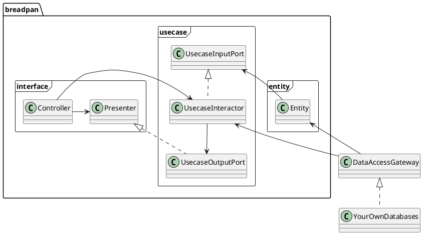
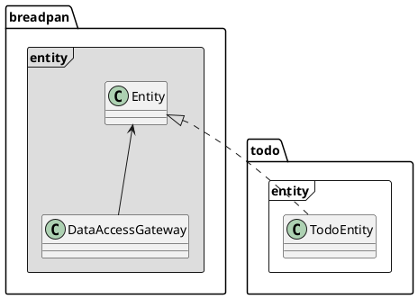
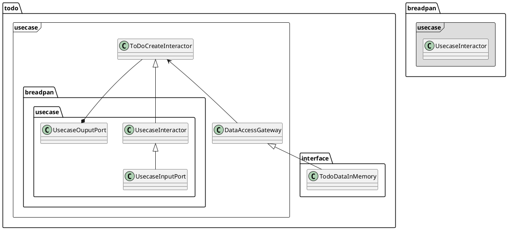
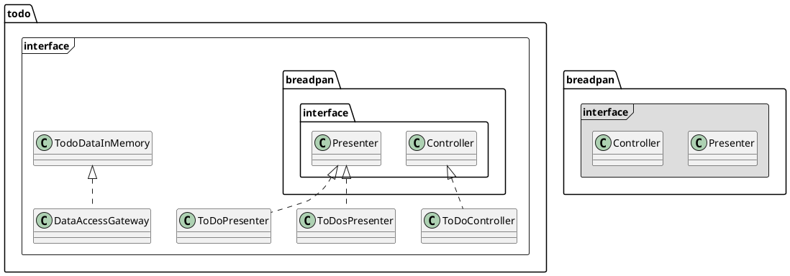

Breadpan으로 서비스를 구현하는 방법
===========

Breadpan이 지향하는 기본 구조는 Clean architecture에서 주장하는 기본 개념들을 최대한 이용한다. 

서비스 구현 방법
-----

현재 추천하는 방법은 아래와 같다. 
1. Clean architecture의 개념에 따라 각 Package들의 기본 Class구조를 상속받아서 자신만의 Entity, Usecase, Controller, Presenter를 구현한다. 
2. 1.에 대한 Test code를 작성한다. 
3. 2.에 기반해서 이를 다양한 응용 프로그램으로 만든다. ex)RESTful API server.
    - View에 보여줄 ViewModel까지 만드는게 Back-end가 할 일이다. 
4. View에 해당하는 모든 기능은 Front-end에서 구현한다. 최대한 Front-end는 복잡한 구현이 없도록 한다. 


3개 Package들
------

내부에는 크게 3개의 package가 있다. 
* ```entity```
    - 내부에서 사용하는 고수준의 규칙들을 구현
* ```usecase```
    - Entity로 들어가고 나가는 모든 데이터 흐름을 조정하고 관리 
* ```interface```
    - 외부의 다른 구현들과 연결 (예: 웹)하는데 있어서 필요한 작업 처리  





예제로 설명하기
---------

 ```breadpan```안에는 ```todo``` 라는 예제가 ```backend/breadpan/todo```에 구현 되어 있다. 이것은 아주 간단하게 breadpan을 적용한 예제이다. 


### Entity

 Entity는 기본적인 업무규칙과 객체들에 대해 담는다. ToDo를 관리하는 시스템이기에 아래와 ```Entity```를 상속해서 만들 수 있다. 현재는 다른 할 일이 없어서지만, 여기에 이 Entity를 가지고 무언가 동작해야 하는 것들을 추가할 수도 있다. 이 Entity는 DataAccessGateway를 통해 그 데이터를 관리하게 된다. 

```python
from breadpan.entity import Entity

class ToDoEntity(Entity):
    """ ToDoEntity represents the ToDo item
    """
    def __init__(self, todo_id, task):
        """Constructor 
        
        Arguments:
            todo_id {[string]} -- the ID of todo item. 
            task {[string]} -- the contents of task.
        """
        self.todo_id = todo_id
        self.task = task
```




### Usecase

이 계층에서 실질적인 Operation들을 구현하게 된다. 

`UsecaseInputPort`는 외부에서 들어오는 데이터들을 가지고 `UsecaseInteractor`에 데이터를 전달하는 역할을 한다. `UsecaseInteractor`는 `UsecaseInputPort`를 상속 받아서 사용하게 된다. 

예를 들어, `ToDoCreateInteractor`는 `UsecaseInteractor`를 상속받아서 `run()`을 아래처럼 구현한다. `self.input`은 이 class의 constructur에서 입력받은 key/value argument들을 보관하고 있다. 이로서 arguement의 data 형식에서 자유로워질 수 있다.  `self.input`의 데이터를 가지고 작업을 작업을 한 다음, `DataAccessGateway`를 통해 저장한다.  
```python
class ToDoCreateInteractor(UsecaseInteractor):
    def run(self,  data: DataAccessGateway):        
        # Get id from the controller's data. 
        todo_id = self.input["todo_id"]
        contents = self.input["contents"]
        t = ToDoEntity(todo_id, contents['task'])

        # Store the data. 
        data.create(t)

        # Link to output port
        return UsecaseOutputPort(todo=t)
```

이렇게 구현한 `ToDoCreateInteractor`는 아래처럼 Constructor에 key/value argument로 원하는 데이터를 집어넣는다. 그 다음 `run()`을 실행한다.   

``` python
data = TodoDataInMemory() 
interactor = ToDoCreateInteractor(todo_id=todo_id, contents=contents)
interactor.run(data)  # ToDoCreateInteractor의 run()실행.
```

```UsecaseOutputPort```은 역시, 외부로 보내는 데이터들을 별도로 저장해서 보내기 위한 구조다. 이것은 Interface 계층에서 더 자세하게 설명할 수 있다. 

이러한 관계들을 정리해보면, 아래와 같은 관계가 된다. 


### Interface
 
 실제적으로 


