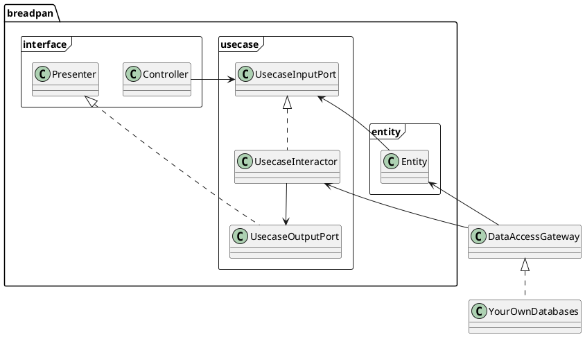
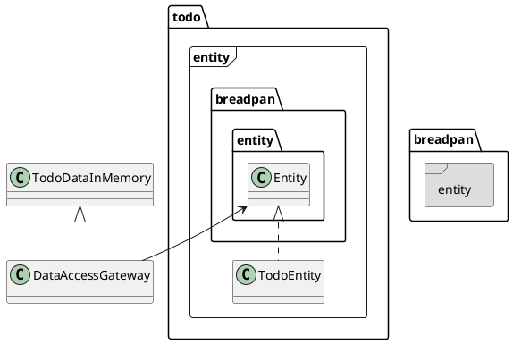
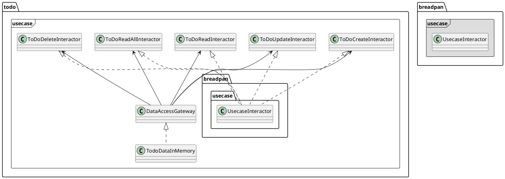
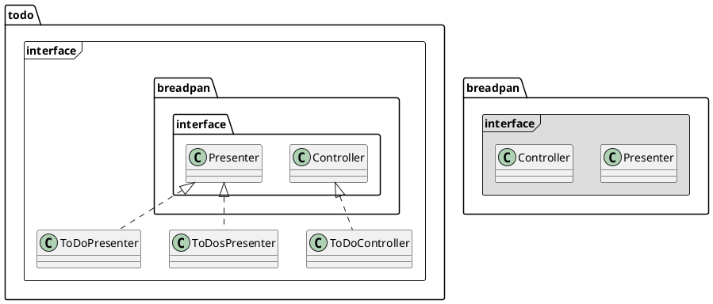

Breadpan으로 서비스를 구현하는 방법
===========

Breadpan이 지향하는 기본 구조는 Clean architecture에서 주장하는 기본 개념들을 최대한 이용한다. 

서비스 구현 방법
-----

현재 추천하는 방법은 아래와 같다. 
1. Clean architecture의 개념에 따라 각 Package들의 기본 Class구조를 상속받아서 자신만의 Entity, Usecase, Controller, Presenter를 구현한다. 
2. 1.에 대한 Test code를 작성한다. 
3. 2.에 기반해서 이를 다양한 응용 프로그램으로 만든다. ex)RESTful API server.
    - View에 보여줄 ViewModel까지 만드는게 Back-end가 할 일이다. 
4. View에 해당하는 모든 기능은 Front-end에서 구현한다. 최대한 Front-end는 복잡한 구현이 없도록 한다. 


3개 Package들
------

내부에는 크게 3개의 package가 있다. 
* ```entity```
    - 내부에서 사용하는 고수준의 규칙들을 구현
* ```usecase```
    - Entity로 들어가고 나가는 모든 데이터 흐름을 조정하고 관리 
* ```interface```
    - 외부의 다른 구현들과 연결 (예: 웹)하는데 있어서 필요한 작업 처리  





예제로 설명하기
---------

 ```breadpan```안에는 ```todo``` 라는 예제가 ```backend/breadpan/todo```에 구현 되어 있다. 이것은 아주 간단하게 breadpan을 적용한 예제이다. 


### Entity / DataGateway



### Usecase





### Interface


