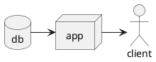

서비스를 구현 하는 방법
===========

Breadpan이 지향하는 기본 구조는 Clean architecture에서 주장하는 기본 개념들을 최대한 이용한다. 

```plantuml
@startuml component
actor client
node app
database db

db -> app
app -> client
@enduml
```

