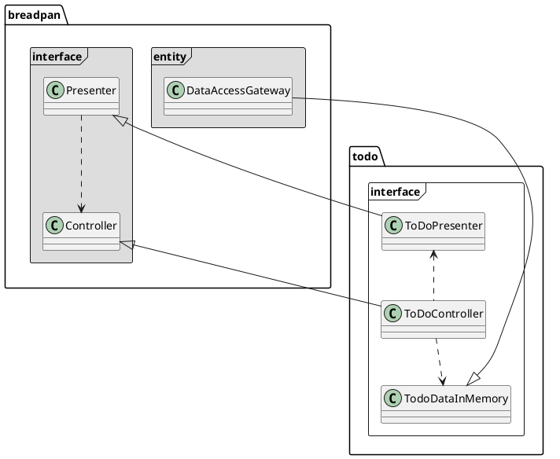

Breadpan으로 서비스를 구현하는 방법
===========

Breadpan이 지향하는 기본 구조는 Clean architecture에서 주장하는 기본 개념들을 최대한 이용한다. 

서비스 구현 방법
-----

현재 추천하는 방법은 아래와 같다.
1. 각 Package들의 기본 Class구조를 상속받아서 자신만의 Entity, Usecase, Controller, Presenter를 구현한다. 
2. 1.에 대한 Test code를 작성한다. 
3. 2.에 기반해서 이를 다양한 응용 프로그램으로 만든다. ex)RESTful API server.
    - View에 보여줄 ViewModel까지 만드는게 Back-end가 할 일이다.
4. View에 해당하는 모든 기능은 Front-end에서 구현한다. 최대한 Front-end는 복잡한 구현없이 Controller부분에서 만들어 낸 데이터를 보여주거나 조작하는 정도만 구현한다.


3개 계층들
------

Breadpan은 크게 3개의 계층으로 모듈들을 구분한다. 
* ```entity```
    - 내부에서 사용하는 고수준의 규칙들을 구현
* ```usecase```
    - Entity로 들어가고 나가는 모든 데이터 흐름을 조정하고 관리 
* ```interface```
    - 외부의 다른 구현들과 연결 (예: 웹)하는데 있어서 필요한 작업 처리  


<!-- ```plantuml
@startuml

class YourOwnDatabases

package breadpan.entity <<Frame>> {
    Entity ..> DataAccessGateway
}

package breadpan.usecase <<Frame>> {

    UsecaseInputPort ..> Entity
    UsecaseInputPort <|-- UsecaseInteractor
    UsecaseInteractor ..> UsecaseOutputPort
    UsecaseInteractor ..> DataAccessGateway
    DataAccessGateway <|-- YourOwnDatabases
}

package breadpan.interface <<Frame>> {
  Presenter --|> UsecaseOutputPort
  Controller ..> UsecaseInteractor
  Controller ..> Presenter
}

@enduml
``` -->


예제로 설명하기
---------

 ```breadpan```안에는 ```todo``` 라는 예제가 ```backend/breadpan/todo```에 구현 되어 있다. 이것은 아주 간단하게 breadpan을 적용한 예제이다. 


### Entity

 Entity는 기본적인 업무규칙과 객체들에 대해 담는다. 예를 들어 ToDo를 관리하는 시스템을 만든다면 아래처럼 ```Entity```를 상속해서 만들 수 있다. 여기에 이 Entity를 가지고 무언가 동작해야 하는 것들을 추가할 수도 있다. 
 
```python
from breadpan.entity import Entity

class ToDoEntity(Entity):
    """ ToDoEntity represents the ToDo item
    """
    def __init__(self, todo_id, task):
        """Constructor 
        
        Arguments:
            todo_id {[string]} -- the ID of todo item. 
            task {[string]} -- the contents of task.
        """
        self.todo_id = todo_id
        self.task = task
```


<!-- ```plantuml
@startuml

package breadpan.entity <<Frame>> #DDDDDD {
    breadpan.entity.Entity ..> DataAccessGateway
}

package todo.entity <<Frame>> {
    breadpan.entity.Entity <|-- TodoEntity
}
@enduml
``` -->


### Usecase

이 계층에서 실질적인 Operation들을 구현하게 된다. **이로서 arguement의 data 형식에서 자유로워질 수 있다.**

`UsecaseInputPort`는 외부에서 들어오는 데이터들을 가지고 `UsecaseInteractor`에 데이터를 전달하는 역할을 한다. `UsecaseInteractor`는 `UsecaseInputPort`를 상속 받아서 사용하게 된다. 

예를 들어, `ToDoCreateInteractor`는 `UsecaseInteractor`를 상속받아서 `run()`을 아래처럼 구현한다. `self.input` 변수는 이 class의 constructur에서 입력받은 key/value argument들을 보관하고 있다. 이렇게 해서 arguement의 data 형식에서 자유로워질 수 있다. `self.input`의 데이터를 가지고 작업을 작업을 한 다음, `DataAccessGateway`를 통해 저장한다.

```python
class ToDoCreateInteractor(UsecaseInteractor):
    def run(self,  data: DataAccessGateway):
        # 앞서 입력받은 데이터에서 toto entity를 만든다.
        todo_id = self.input["todo_id"]
        contents = self.input["contents"]
        t = ToDoEntity(todo_id, contents['task'])

        # 데이터를 DB에 저장
        data.create(t)

        # Output port로 데이터를 내보낸다. 이때 todo라는 key를 주고 value로 앞서 만든 todo entity를 준다.  
        return UsecaseOutputPort(todo=t) 
```

이렇게 구현한 `ToDoCreateInteractor`는 아래처럼 Constructor에 key/value argument로 원하는 데이터를 집어넣는다. 그 다음 `run()`을 실행한다.

``` python

# Memory를 이용해서 ToDo entity를 저장하는 key/value DB를 구현.
data_base = TodoDataInMemory() 

# ToDoCreateInteractor의 run()실행. 이때 작업할 결과를 저장할 DB를 지정.
interactor = ToDoCreateInteractor(todo_id=todo_id, contents=contents)
interactor.run(data_base)  
```

`UsecaseOutputPort`은 역시, 외부로 보내는 데이터들을 별도로 저장해서 보내기 위한 구조다. 이것은 Interface 계층에서 더 자세하게 설명할 수 있다.

이러한 관계들을 정리해보면, 아래와 같은 관계가 된다. 


 <!-- ```plantuml
 @startuml
 
 package todo.usecase <<Frame>> {
     DataAccessGateway <|-- todo.interface.TodoDataInMemory
     ToDoCreateInteractor <|-- breadpan.usecase.UsecaseInteractor
     breadpan.usecase.UsecaseInteractor <|-- breadpan.usecase.UsecaseInputPort
     breadpan.usecase.UsecaseOuputPort <.. ToDoCreateInteractor
     ToDoCreateInteractor ..> DataAccessGateway
    }

 package breadpan.usecase <<Frame>> #DDDDDD{
     class UsecaseInteractor
 }
 @enduml
 ``` -->


### Interface
 
 실제적으로 외부 프레임워크나 데이터베이스와 연결이 되는 부분들을 구현하는 부분이다.
 
 `Controller`의 경우, 외부 프레임워크에 직접 붙어서 운영이 되는 모듈이다. 예를 들어, `ToDoController`의 구현은 아래와 같다. 

```python
class ToDoController(Controller):

    def __init__(self):
        self.__data = TodoDataInMemory() # Memory를 이용하게 구현한 DB 모듈.

    def create(self, todo_id, contents):
        i = ToDoCreateInteractor(todo_id=todo_id, contents=contents)
        return ToDoPresenter(i.run(self.__data)).show()
    ......
```
실제 이를 가지고 Flask에 연결해서 사용한다면, 이렇게 쓰이게 된다. 

```python
class FlaskTodoListController(Resource):

    def post(self):
        args = parser.parse_args()
        all_data = todoCtrl.read_all_data()

        todo_id = len(all_data) + 1
        todo_id = 'todo%i' % todo_id
        task = {'task': args['task']} 

        todoCtrl.create(todo_id, task)
        return task, HTTPStatus.CREATED

.....

api.add_resource(FlaskTodoController, '/todos/<todo_id>')
```

여기서 `ToDoPresenter`의 역할은 내부의 `ToDoEntity`로 정의된 데이터를 외부에서 이용하기 위한 데이터 형식으로 바꿔준다. (이 경우에는 RESTful을 위한 JSON) 이러한 구조가 필요한 이유는 **내부 구현은 문제가 없으나 외부의 인터페이스를 맞춰주어야 하는 경우 때문이다.** 

아래 코드에서 처럼 `Presenter`를 상속받고 `show()`함수를 구현해주면 된다. 

``` python
class ToDoPresenter(Presenter):
    """ToDoPresenter
    
    Convert ToDoEntity to {todo.id : {'task': todo.task}} for RESTful response as view. 
    """
    def show(self):
        todo_entry = self.output['todo'] # Take the data with key 'todo' TodoController exposed.
        return { todo_entry.todo_id : {'task':todo_entry.task}  }
```

현재의 interface계층의 구조는 아래와 같다.


<!-- 


각 함수들의 목적은 아래와 같다.
 * `create()` : Entity를 DB에 생성하는 기능을 구현
 * `read()` : 지정된 Engity를 읽어오는 기능을 구현  
 * `read_all()` : 저장된 Entity를 모두 읽어오는 기능을 구현
 * `update()` : 지정된 Entity를 update하고자 하는 기능을 구현 
 * `delete()` : 지정된 Entity를 삭제하는 기능을 구현 


### View에 대한 구현
- 현재는 Front-end / Back-end 따로 구현하고 그 사이를 RESTful API로 만드는 방식을 추천한다. 
- 최대한 Front-end는 주어진 데이터를 시각적 구조에 보여주는 View에 대한 구조를 맞춰서 작업을 하기를 권한다.
    - 데이터 형식의 변경이나 새로운 종합적인 데이터를 필요로 할 때는 무조건 Back-end에서 해서 보내주는 것을 원칙으로 한다. Presenter class가 있는 이유가 이런 용도다. 
- Front-end 자체도 훌륭한 Architecture를 가질 수 있어야 한다. 이것은 별도로 정의하겠다. 
- 그 외에 Front-end의 경우에는 [Google optimize](https://optimize.google.com/)와 같은 A/B test 도구들을 지원해서 더 다양한 Business운영의 실험을 할 수 있게 하기를 권한다.

